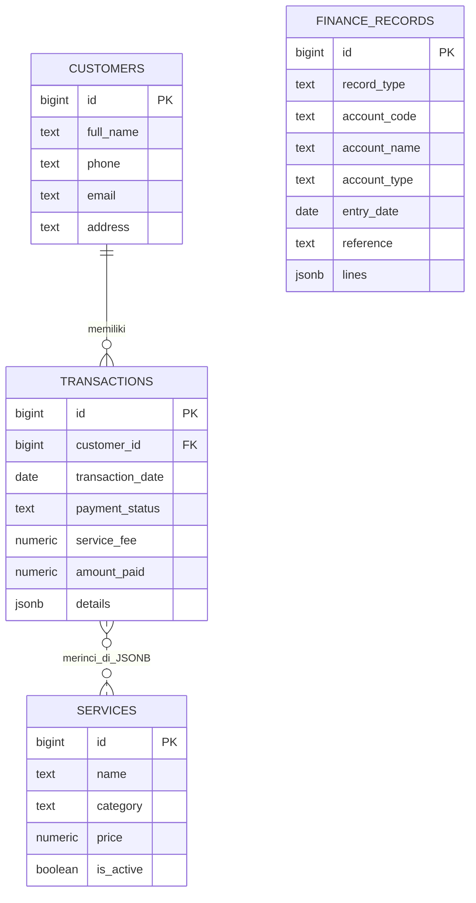

# SHOPLY

Sistem informasi akuntansi untuk jasa personal shopper fashion. Aplikasi memakai tepat empat tabel Supabase: pelanggan, layanan/produk, transaksi (termasuk rincian pesanan), dan catatan keuangan (akun serta jurnal).

## Struktur Proyek

```text
shoply/
├── README.md
├── backend/
│   ├── config.js
│   └── database.sql
└── frontend/
    ├── index.html
    ├── style.css
    └── app.js
```

## ERD



Rincian transaksi disimpan dalam `transactions.details`; `finance_records.record_type` membedakan baris akun dan jurnal, dengan rincian jurnal di kolom `lines`.

## Menjalankan Aplikasi

1. Buat project di [Supabase](https://supabase.com/).
2. Buka **SQL Editor** pada project tersebut, lalu jalankan seluruh isi `backend/database.sql`. Skrip membuat empat tabel, katalog demo, bucket Storage foto produk, dan policies upload yang dibatasi ke bucket SHOPLY.
3. Buka **Project Settings > API**. Salin Project URL dan anon/publishable key ke variabel `SUPABASE_URL` dan `SUPABASE_ANON_KEY` di `backend/config.js`.
4. Simpan perubahan, lalu buka `frontend/index.html` langsung di browser. Aplikasi memuat Supabase JS melalui CDN, sehingga koneksi internet diperlukan.

Jangan pernah menaruh `service_role` key di frontend. RLS tabel operasional dinonaktifkan untuk demo; policy Storage hanya membolehkan baca publik dan upload anon/authenticated pada bucket `shoply-products`. Perketat policies sebelum memakai data nyata.

Jika skema lama sudah pernah dijalankan, skrip memindahkan detail transaksi serta akun dan jurnal ke struktur baru, lalu menghapus tabel lama yang sudah dipindahkan. Cadangkan database sebelum menjalankan migrasi. Menjalankan ulang skrip aman untuk data yang sudah ada.

## Fitur

- CRUD pelanggan, layanan/produk, transaksi, dan detail transaksi; detail disimpan bersama transaksi.
- Ringkasan jumlah transaksi, pelanggan, dan total pembayaran yang diterima.
- Siklus keuangan: jurnal penjualan otomatis, pencatatan beban berpasangan, jurnal umum, buku besar dengan saldo awal, neraca saldo kumulatif, dan laporan laba rugi per periode.
- Katalog 48 listing referensi untuk 12 brand, dengan filter kategori, pencarian, dan harga estimasi. Foto bisa diunggah langsung (JPG/PNG/WebP, maksimal 5 MB) atau memakai URL.
- Order desk interaktif: tambah produk, atur kuantitas, pilih pelanggan, tambahkan biaya jasa, lalu simpan transaksi beserta detailnya ke Supabase.
- Jurnal penjualan dibentuk dari transaksi dan rincian pesanan. Catat HPP atau beban operasional dari menu Keuangan agar ikut masuk ke laporan.
- Formulir validasi dasar, konfirmasi hapus, serta notifikasi sukses/gagal.
- Tampilan responsif dengan navigasi dashboard.

Listing katalog bawaan adalah referensi demo, bukan pernyataan stok atau harga resmi. Empat foto terhubung ke model exact yang ditemukan di halaman produk Gucci, PEDRO, dan Lacoste; listing lainnya sengaja tidak memakai foto pengganti sampai ada foto produk yang cocok. Harga semuanya estimasi. Verifikasi model, autentikasi, harga, dan ketersediaan dengan butik sebelum menerima pembayaran. Unggah foto barang yang Anda bawa melalui form **Layanan & produk**; URL publiknya disimpan di Supabase Storage.

Contoh produk dan aset dirujuk dari [Gucci Giglio Small Tote](https://www.gucci.com/us/en/pr/women/handbags/shoulder-bags-for-women/gucci-giglio-small-tote-bag-p-860845FAF1L9653), [PEDRO Women's Bags](https://www.pedroshoes.com/sg/women/bags), [PEDRO Jatte Crescent Bag](https://www.pedroshoes.com/sg/women/PW2-75210182_CHALK.html), dan [Lacoste Regular Fit Supple Petit Piqué Polo](https://www.lacoste.com/us/lacoste/women/clothing/polos/PF7839-51.html?color=001). Katalog brand lain merupakan listing referensi yang perlu diverifikasi langsung dengan butik masing-masing.